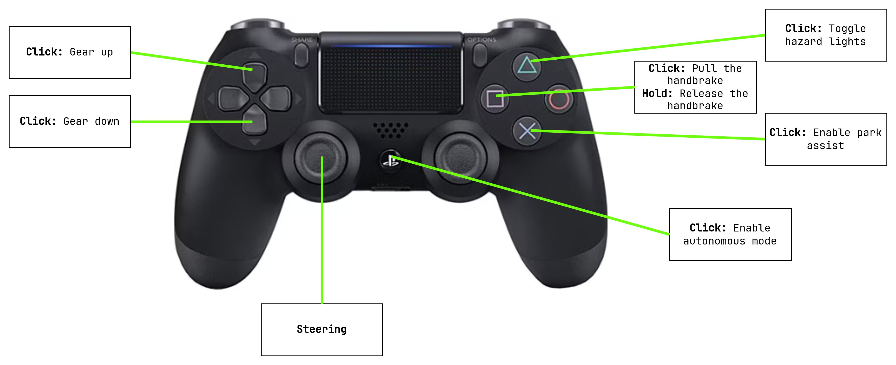
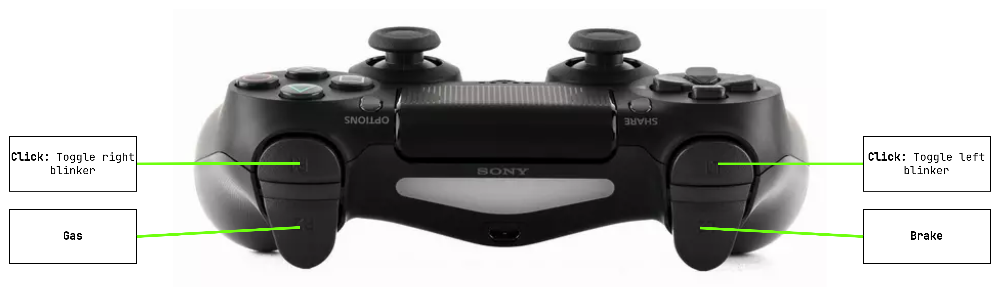

# Leo Drive Gatevcu Driver

This is a ROS 2 driver for the gatevcu.

<!-- TOC -->
* [Leo Drive Gatevcu Driver](#leo-drive-gatevcu-driver)
  * [How to build](#how-to-build)
  * [How to launch](#how-to-launch)
  * [How to configure](#how-to-configure)
  * [How to use ROS 2 API](#how-to-use-ros-2-api)
  * [How to control via gamepad](#how-to-control-via-gamepad)
<!-- TOC -->

## How to build

The driver consists of multiple ROS 2 packages. You need to create a workspace,
pull the repo and install dependencies.

```bash
# Create a workspace
mkdir -p gatevcu_ws/src

# Go into the source directory
cd gatevcu_ws/src

# Clone the repo
git clone https://github.com/leo-drive/leodrive_gatevcu_driver.git
# or (depends on your GitHub authentication method)
git clone git@github.com:leo-drive/leodrive_gatevcu_driver.git

# Go to the workspace root directory
cd ..

# Import dependencies
vcs import src < src/leodrive_gatevcu_driver/gatevcu.repos
rosdep install --from-paths src --ignore-src -y -r

# Build the workspace
colcon build --symlink-install --cmake-args -DCMAKE_BUILD_TYPE=RelWithDebInfo
# or
colbu_rd
```

## How to launch

There is a BASH script to launch the necessary ROS 2 packages and configure CAN network.

```bash
# Assuming you are inside the workspace directory
cd src/leodrive_gatevcu_driver/
./run_gatevcu.bash

# or
./run_gatevcu.bash --interface can1 --launch-joy false
```

```text
$ ./run_gatevcu.bash --help

Usage: ./run_gatevcu.bash [OPTIONS]

Activate a CAN interface and launch a ROS 2 command.

Options:
  -h, --help            Show this help message and exit
  -i, --interface       Name of the CAN interface (default: can0)
  -b, --bitrate         Bitrate of the CAN interface (default: 500000)
  -j, --launch-joy      Whether to launch joy stack or not (default: true)

After setting up the network interface, this script searches for the 'setup.bash' script
in parent directories recursively. Once found, it sources the 'setup.bash' script and
launches the 'ros2 launch leodrive_gatevcu_driver driver.launch.xml' command.
```

If you want to control the vehicle via gamepad, `launch-joy` must be enabled which is the default.
If you want to control the vehicle via publishing command messages to corresponding ROS 2 topics, you may disable it.

## How to configure

There is a config file inside the `config` directory of the  `leodrive_gatevcu_driver` package. These parameters are
only used for gamepad.

| Parameter             | Description                                             | Default |
|-----------------------|---------------------------------------------------------|---------|
| joy_timeout           | The duration to assume gamepad was lost in milliseconds | 100     |
| max_gas_pedal_pos     | Maximum value of the gas pedal.                         | 100.0   |
| max_steering_angle    | Maximum value of the steering angle.                    | 475.0   |
| steering_wheel_torque | Torque of the steering wheel.                           | 255     |
| enable_ramp           | Whether to enable smooth steering.                      | true    |
| steering_rate         | Steering change rate for smooth steering.               | 2.0     |

## How to use ROS 2 API

There are three ROS 2 topics to send various commands to the VCU.

| Topic                     | Message Type                              | Description                                                                              |
|---------------------------|-------------------------------------------|------------------------------------------------------------------------------------------|
| `/gatevcu/longitudinal`   | `leodrive_gatevcu_msgs/msg/Longitudinal`  | Controls gas pedal and brake pedal.                                                      |
| `/gatevcu/steering_wheel` | `leodrive_gatevcu_msgs/msg/SteeringWheel` | Controls steering angle and sets steering torque.                                        |
| `/gatevcu/vehicle`        | `leodrive_gatevcu_msgs/msg/Vehicle`       | Controls blinker, head_light, wiper, gear, mode, hand_brake, takeover_request, long_mode |

## How to control via gamepad



<br />

